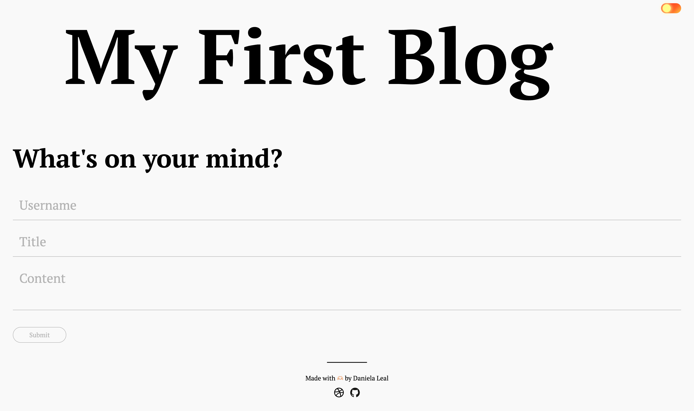
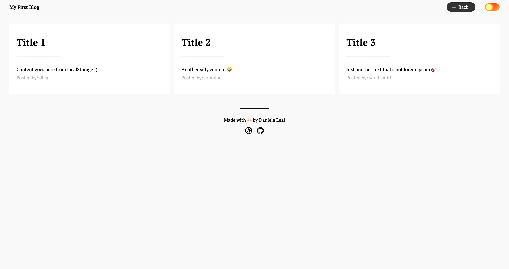

# Web APIs: Personal Blog

## Description
Dynamic two-page website for generating blog posts. Includes a form that stores all the data in localStorage, dynamically renders the blog posts, and implements a light/dark mode toggle.

## Installation 
1. Clone the repository using the SSH key on your local machine with the command `git clone`, followed by the link provided by GitHub
2. Pull the project using the command `git pull`
3. Open the file index.html in your default browser.

## Usage
1. Open index.html in the default browser to view the website properly.
2. Fill out the form with a username, title, and text content for the post.
3. Submit the form.
4. Open the application in DevOps and check if the information is stored in localStorage.
5. Verify that the information filled out on the homepage is displayed on the redirected page.
6. Toggle the website theme to Dark.
7. Return to the homepage to continue posting.

It should resemble the images below.
  
  
  

## Credits
AskBCS Learning Assistant

[YouTube | CSS Dark Mode Toggle Button from scratch in 6 Minutes](https://www.youtube.com/watch?v=S-T9XoCMwt4&embeds_referring_euri=https%3A%2F%2Fwww.notion.so%2F&source_ve_path=MjM4NTE&feature=emb_title)

[Egggradients | Gradient background colors](https://stackoverflow.com/questions/52884294/how-to-handle-the-end-of-javascript-while-loop)

## License
This blog is open-source and available under the MIT License.

